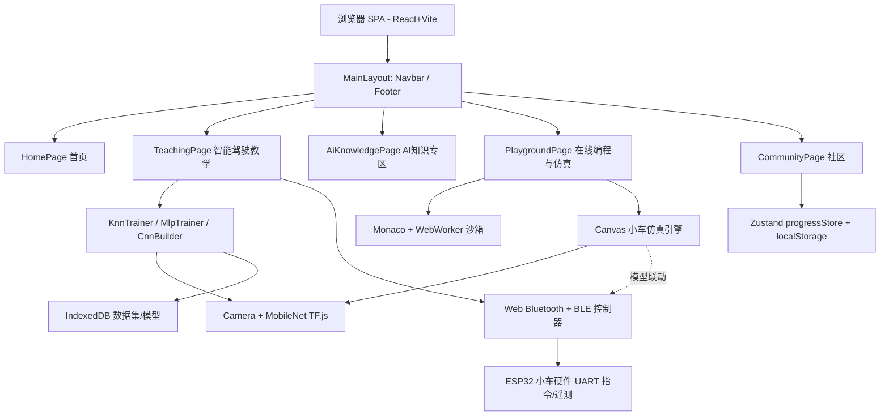

# 智能驾驶与人工智能教学网站 — 项目执行规范

> 版本：v1.0　|　制定日期：2026-07-16　|　状态：已确认，进入开发
> 适用对象：前端开发团队、课程与内容团队、硬件联调团队

---

## 目录

1. [项目概述](#1-项目概述)
2. [功能模块划分](#2-功能模块划分)
3. [核心技术依赖与架构](#3-核心技术依赖与架构)
4. [Web Bluetooth 硬件联动规范（核心依赖，不可替代）](#4-web-bluetooth-硬件联动规范核心依赖不可替代)
5. [实现步骤及时间线](#5-实现步骤及时间线)
6. [目录结构与代码契约](#6-目录结构与代码契约)
7. [设计风格规范](#7-设计风格规范)
8. [验收与验证](#8-验收与验证)

---

## 1. 项目概述

### 1.1 项目定位
面向**高中生**的「智能驾驶与人工智能教学网站」，以**智能小车校园网应用**为核心载体。学生通过浏览器即可完成 AI 模型训练、小车行为仿真，并经由 **Web Bluetooth 真实连接 ESP32 小车硬件**形成「网页 AI → 真实小车」闭环，无需注册、无需后端服务器、可纯静态托管。

### 1.2 设计基调
- **风格**：浅色明亮清新 + 轻科技感（蓝-青渐变主色、紫罗兰点缀、圆角卡片、柔和阴影、微动效）。
- **适配**：全站响应式（桌面多列网格 / 移动端单列堆叠并保留底部导航）。
- **体验目标**：年轻化、简洁直观、专业易懂。

### 1.3 核心特征
| 特征 | 说明 |
| --- | --- |
| 免费免注册 | 浏览器端算力，无账号体系，开箱即用 |
| 端侧 AI | TensorFlow.js（WebGL 后端）在客户端完成训练与推理 |
| 梯度课程 | 入门(KNN) → 进阶(MLP) → 高级(CNN) 三层难度递进 |
| 真实硬件联动 | **Web Bluetooth 连接 ESP32 小车**，下发指令 / 回传遥测 |
| 可静态托管 | GitHub Pages / 静态主机 / PWA 离线均可部署 |

### 1.4 五大模块总览
1. **首页**：核心价值与智能小车场景展示。
2. **智能驾驶教学**：分阶课程 + 三种难度算法真实训练 + 硬件实操。
3. **AI 知识专区**：基础算法与模型讲解，按难度分层递进。
4. **在线编程与模拟仿真**：浏览器代码运行沙箱 + Canvas 小车仿真。
5. **社区**：学习进度跟踪与成果展示。

---

## 2. 功能模块划分

### 2.1 模块一 · 首页（HomePage）
- Hero 区块：主标题 + 价值主张 + 双 CTA + 小车场景插画。
- 核心价值卡片：免注册 / 端侧算力 / 梯度课程 / 硬件联动（4 张特性卡）。
- 智能小车场景区：教室 / 操场 / 家庭（三场景网格卡片）。
- 学习路径区：入门 → 进阶 → 高级时间线引导，点击跳转教学页。

### 2.2 模块二 · 智能驾驶教学（TeachingPage）
- 难度 Tabs（入门 / 进阶 / 高级）切换课程集。
- 课程卡片：算法说明、算力需求、课时、「开始实操」按钮。
- 实操训练器（三种难度分别实现）：
  - **入门 KnnTrainer**：MobileNet 特征提取 + KNN 四分类（前进/左/右/停），数十张图即可训练。
  - **进阶 MlpTrainer**：MobileNet + MLP，可调学习率 / 隐藏层等超参，训练快。
  - **高级 CnnBuilder**：自定义 CNN 从零搭建，每类需 200+ 图，高算力。
- 分步引导步骤条：采集 → 训练 → 验证 → **Web Bluetooth 连接真实小车**。
- 集成 **BluetoothPanel**：设备扫描、连接状态灯、前/左/右/停指令、电量/速度遥测、一键重连。

### 2.3 模块三 · AI 知识专区（AiKnowledgePage）
- 难度分层导览：基础 / 进阶 / 高阶标签页。
- 知识卡片网格：KNN / CNN / MLP / 激活函数 / 卷积 / 迁移学习等讲解卡。
- 文章详情：图文讲解 + 可交互可视化小部件（激活函数曲线、卷积动画等）。
- 学习路线建议：推荐顺序与前置知识提示。

### 2.4 模块四 · 在线编程与模拟仿真（PlaygroundPage）
- 左栏代码编辑器（Monaco），语言切换 + 示例下拉。
- 右栏控制台输出：实时日志、推理耗时、帧率。
- 仿真区：Canvas 2D 赛道，参数面板（速度/转向/灵敏度）+ 「模型联动」开关。
- 「连接真实小车」开关：模型联动时指令经 **Web Bluetooth** 同步下发 ESP32。
- 预置示例：KNN / CNN 小 demo 一键运行验证。
- 代码沙箱：Web Worker 安全 eval（JS），可选 Pyodide 运行 Python。

### 2.5 模块五 · 社区（CommunityPage）
- 个人进度面板：进度环 + 徽章墙（localStorage 驱动）。
- 成果展示网格：学生作品 / 模型分享卡（点赞 / 评论占位）。
- 排行榜：学习时长 / 完成课程榜单。
- 投稿入口：分享表单占位（本地预览）。

---

## 3. 核心技术依赖与架构

### 3.1 技术栈
| 类别 | 选型 | 说明 |
| --- | --- | --- |
| 框架 | React 18 + Vite + TypeScript | 组件生态成熟，TF.js 官方示例多为 React |
| 样式 | Tailwind CSS + shadcn/ui | 美观、无障碍、可定制浅色主题 |
| 路由 | React Router（HashRouter） | 兼容 GitHub Pages 静态托管，避免刷新 404 |
| 状态 | Zustand | 训练会话、仿真参数、学习进度、蓝牙连接与遥测 |
| 机器学习 | @tensorflow/tfjs + @tensorflow-models/mobilenet | WebGL 后端，端侧训练/推理 |
| 编辑器/沙箱 | Monaco Editor + Web Worker | 安全代码运行；可选 Pyodide 支持 Python |
| 仿真 | Canvas 2D 自研引擎 | 小车物理 / 循迹 / 避障 |
| 硬件联动 | **Web Bluetooth（GATT / NUS）** | 连接 ESP32 小车，不可替代，详见第 4 章 |
| 持久化 | localStorage + IndexedDB（idb） | 进度/徽章、图像数据集与模型权重 |
| 图表 | 轻量 Canvas/SVG 自绘 | 训练损失/准确率曲线，避免重型依赖 |

### 3.2 架构图


### 3.3 关键工程策略
- **按需加载**：重型模块（CNN 训练器、Pyodide、蓝牙控制器）用 `React.lazy` 动态加载，首屏轻量。
- **GPU 安全**：TF.js 固定 WebGL 后端 + 模型 warmup；训练中及时 `dispose` 张量，提供显存监视。
- **摄像头**：`getUserMedia` 抽帧（10–15fps 节流）；权限被拒时提供本地图片上传兜底。
- **沙箱隔离**：代码运行放入 Web Worker，对输入做白名单/超时限制。
- **仿真联动**：仿真引擎订阅训练好的分类器接口，演示「模型驱动小车行为」。

---

## 4. Web Bluetooth 硬件联动规范（核心依赖，不可替代）

> **定位声明**：Web Bluetooth 是本项目的**核心技术依赖**与**不可替代约束条件**。它直接承载「网页端 AI → 真实 ESP32 小车」的闭环，是本项目区别于纯软件教学工具的关键差异化能力，任何方案均不得用其他方式绕过或降级为本项目主路径（不支持的浏览器仅作「仿真降级通道」，而非替代主功能）。

### 4.1 不可绕过的约束条件（必须遵守）
1. **安全上下文约束**：Web Bluetooth 仅在 **HTTPS 或 localhost** 下可用。生产部署必须使用 HTTPS，否则 `navigator.bluetooth` 为 `undefined`。
2. **浏览器内核约束**：仅 **Chromium 系（Chrome / Edge / Android Chrome）** 原生支持；Safari / Firefox 不支持。对非支持浏览器必须**明确提示**并提供「仿真模式」降级通道，但**降级不视为功能实现**，目标教学环境须以 Chromium 为准。
3. **用户手势约束**：`requestDevice()` 必须由**用户点击等手势触发**，无法静默扫描；任何自动化扫描流程不得绕过该约束。
4. **协议约束**：必须与 ESP32 端 **Nordic UART Service (NUS)** BLE UART 固件匹配，不得自定义不兼容的特征值。
5. **不可替代性**：项目核心交付物之一即为「真实小车远程控制」，禁止以纯仿真、HTTP、WebSocket 或第三方插件方案替代主链路（除非目标硬件本身变更并经评审）。

### 4.2 协议与特征值配置（匹配 ESP32 固件）
采用业界通用 **Nordic UART Service (NUS)**，对应 ESP32 端 NimBLE / BluetoothSerial BLE UART 固件：

| 项目 | UUID |
| --- | --- |
| NUS Service | `6E400001-B5A3-F393-E0A9-E50E24DCCA9E` |
| TX Characteristic（Web → ESP32，写） | `6E400002-B5A3-F393-E0A9-E50E24DCCA9E` |
| RX Characteristic（ESP32 → Web，notify） | `6E400003-B5A3-F393-E0A9-E50E24DCCA9E` |

- **指令编码**（教学友好、可读文本行协议，以 `\n` 结尾）：
  - `F`(前进) / `L`(左) / `R`(右) / `S`(停)
  - 带速度：`F,120\n`
  - 扩展 JSON：`{"cmd":"F","spd":120}`
- **遥测回传**：ESP32 周期 notify，文本如 `BAT:87|SPEED:120|MODE:AUTO|ERR:0` 或 JSON `{"bat":87,"spd":120,"mode":"auto","err":0}`，解码后写入遥测 store。

### 4.3 功能需求一 · 蓝牙设备扫描
- **特性检测**：`'bluetooth' in navigator` 且处于安全上下文（HTTPS/localhost）；不支持则进入仿真降级。
- **扫描触发**：用户点击「扫描设备」按钮调用 `navigator.bluetooth.requestDevice()`，过滤器：
  - `filters: [{ services: [NUS_SERVICE] }]` 或 `{ namePrefix: 'ESP32' }`
  - `optionalServices: [NUS_SERVICE]`
- **结果呈现**：扫描到的设备列表展示名称 / ID；用户选择后缓存 `device` 对象以支持「一键重连」。
- **扫描约束**：扫描须在主线程用户手势内触发，禁止后台静默扫描。

### 4.4 功能需求二 · 连接建立
1. `device.gatt.connect()` 建立 GATT 连接。
2. `getPrimaryService(NUS_SERVICE)` 获取主服务。
3. 获取 TX / RX 特征值。
4. `rxChar.startNotifications()` 并注册 `characteristicvaluechanged` 回调。
5. 注册 `device` 的 `gattserverdisconnected` 监听，用于意外断开处理。
6. 连接状态机：`idle → scanning → connecting → connected`（失败回 `error`）。

### 4.5 功能需求三 · 数据双向通信
- **下行（Web → ESP32）**：
  - 训练/推理所得指令经 `txChar.writeValue(encode(command))` 下发；默认 `writeWithoutResponse` 降低延迟。
  - 指令做**节流**与**确认超时**机制，避免刷屏与丢指令。
  - `writeValue` 失败时回退 `writeWithoutResponse`。
- **上行（ESP32 → Web）**：
  - `characteristicvaluechanged` 回调解码遥测 → 更新 `bluetoothStore`（电量 / 速度 / 模式 / 错误码）。
  - 实时显示于 BluetoothPanel。
- **模型联动**：KNN / MLP / CNN 分类器输出 → 经 BLE 驱动真实小车；仿真引擎镜像展示，形成「真车 + 仿真」双视图。

### 4.6 功能需求四 · 状态监控与断线重连
- **主动断开**：`gatt.disconnect()`，清理监听、停止通知、复位状态为 `disconnected`。
- **意外断开处理**：
  - `gattserverdisconnected` 触发 → 状态置 `disconnected`。
  - **指数退避自动重连**：`1s → 2s → 4s → …` 上限约 `10s`。
  - 重连成功后恢复 notify 与指令通道。
- **状态监控面板（BluetoothPanel）**：
  - 连接状态灯（idle/scanning/connecting/connected/disconnected/error）。
  - 实时遥测：电量、速度、模式、错误码。
  - 前/左/右/停 指令按钮 + 一键重连按钮。
  - 错误兜底：连接异常给出可读中文报错与重试入口。

### 4.7 涉及文件
| 文件 | 职责 |
| --- | --- |
| `src/features/bluetooth/esp32Protocol.ts` | NUS UUID 常量、指令/遥测编解码 |
| `src/features/bluetooth/bleController.ts` | GATT 控制器：扫描/连接/写/notify/断开/重连 |
| `src/features/bluetooth/useBluetooth.ts` | 连接状态机 Hook |
| `src/features/bluetooth/bluetoothStore.ts` | Zustand 连接与遥测 store |
| `src/components/shared/BluetoothPanel.tsx` | 扫描/连接/指令/遥测 UI（集成进教学实操区与仿真页） |

---

## 5. 实现步骤及时间线

> 阶段编号即任务依赖顺序。建议采用 7 阶段推进，里程碑节点见下。

| 阶段 | 任务 ID | 内容 | 依赖 | 预估工期 |
| --- | --- | --- | --- | --- |
| P1 | scaffold-project | 工程骨架：Vite+React+TS+Tailwind+Router+布局/导航/主题 | — | 2 天 |
| P2 | build-home | 首页：Hero/价值卡/场景/学习路径 | P1 | 2 天 |
| P3 | build-knowledge | AI 知识专区：分层导览/卡片/详情/可视化 | P1 | 3 天 |
| P4 | build-trainers | 三种算法训练器：KNN / MLP / CNN + 摄像头 + IndexedDB | P1 | 5 天 |
| P5 | build-playground | 在线编程沙箱 + Canvas 仿真引擎 + 模型联动 | P1, P4 | 4 天 |
| P6 | build-bluetooth | Web Bluetooth 模块：NUS 协议/扫描/连接/通信/重连/降级 + 集成 | P1 | 3 天 |
| P7 | build-community | 社区：进度/徽章/成果/排行（localStorage） | P1 | 2 天 |
| P8 | verify-and-optimize | Playwright 验证响应式与核心交互，优化构建 | P2–P7 | 2 天 |

**总预估工期**：约 **23 个工作日**（可并行压缩，P2/P3/P4/P5/P6/P7 在 P1 完成后并行推进）。

**关键里程碑**
- M1（P1 完成）：可运行骨架 + 五大模块路由与导航骨架。
- M2（P4 完成）：三种算法真实可训练（端侧 AI 闭环达成）。
- M3（P6 完成）：真实小车可远程控制（核心差异化能力达成）。
- M4（P8 完成）：全站验收、响应式与降级通道校验通过，可部署。

---

## 6. 目录结构与代码契约

全新工程，创建于 `d:/实验室/智能小车边缘计算`。

```
d:/实验室/智能小车边缘计算/
├── index.html                # SPA 入口
├── package.json              # 依赖与脚本
├── vite.config.ts            # Vite 配置（React 插件、HashRouter 兼容、分包）
├── tsconfig.json             # TypeScript 配置
├── tailwind.config.js        # Tailwind 浅色主题令牌
├── postcss.config.js
├── public/favicon.svg
└── src/
    ├── main.tsx / App.tsx / router.tsx / index.css
    ├── layouts/              # MainLayout / Navbar / Footer
    ├── pages/                # 5 大模块页面 + teaching/ 子训练器
    ├── features/
    │   ├── train/            # useCamera / useMobileNet / knnClassifier / mlpTrainer / cnnBuilder / trainingVis
    │   ├── sim/              # CarSimEngine / useCarSim
    │   ├── code/             # CodeEditor / jsSandbox / pyRunner
    │   ├── progress/         # progressStore / badges
    │   └── bluetooth/        # esp32Protocol / bleController / useBluetooth / bluetoothStore
    ├── components/           # ui/ (shadcn) + shared/ (含 BluetoothPanel)
    ├── content/              # courses / aiKnowledge / community 数据
    └── lib/                  # tf.ts / utils.ts
```

### 关键代码契约
```ts
// 三档算法统一配置契约（features/train/types.ts）
interface TrainingLevel {
  id: 'knn' | 'mlp' | 'cnn';
  title: string;
  difficulty: '入门' | '进阶' | '高级';
  classes: string[];                 // ['前进','左','右','停']
  minSamplesPerClass: number;        // 入门~10，进阶~30，高级 200+
  defaultHyperparams: Record<string, number | number[]>;
  needsGpu: boolean;                 // 高级 CNN 标记高算力
}

// Web Bluetooth 连接状态机（features/bluetooth/useBluetooth.ts）
type BleState = 'idle' | 'scanning' | 'connecting' | 'connected' | 'disconnected' | 'error';

// ESP32 BLE UART 协议契约（features/bluetooth/esp32Protocol.ts）
const NUS_SERVICE = '***REMOVED***';
const NUS_TX_CHAR = '***REMOVED***'; // Web -> ESP32 (write)
const NUS_RX_CHAR = '***REMOVED***'; // ESP32 -> Web (notify)
type CarCommand = 'F' | 'L' | 'R' | 'S';
interface CarTelemetry { bat: number; spd: number; mode: 'manual' | 'auto'; err: number; }
```

---

## 7. 设计风格规范

- **配色**：白 / 浅灰底 + 蓝-青渐变主色 + 紫罗兰点缀。
- **元素**：圆角卡片、柔和阴影、轻微 glassmorphism、hover 微动效（卡片抬升、按钮光晕、数字滚动）。
- **响应式**：桌面多列网格；移动端单列堆叠并保留底部导航。
- **无障碍**：对照 shadcn/ui 无障碍标准，保证对比度与键盘可达。

---

## 8. 验收与验证

- 使用 **playwright-cli** 自动化打开页面、截图并验证：
  - 各模块在桌面 / 移动视口下的响应式布局与导航跳转。
  - 训练器加载、仿真渲染、代码运行、BluetoothPanel 渲染与降级提示。
- 预期结果：首页、教学训练、仿真、社区功能真实可用、无控制台报错；**无 Web Bluetooth 环境下仿真降级通道正常**。
- 真车联调（M3 里程碑）：在 Chromium + HTTPS/localhost 下，确认可扫描、连接、下发 F/L/R/S 指令并回传遥测，断线后可自动重连。
